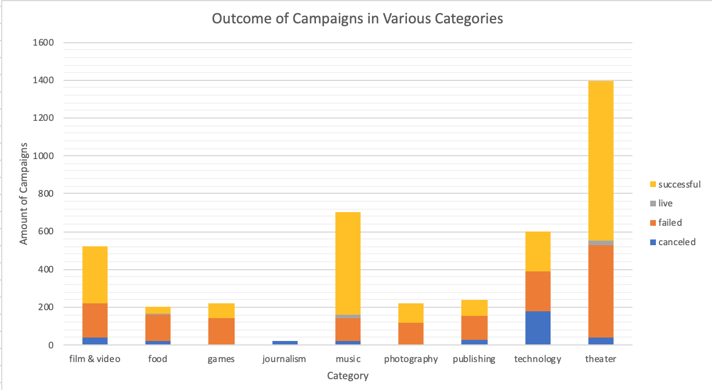
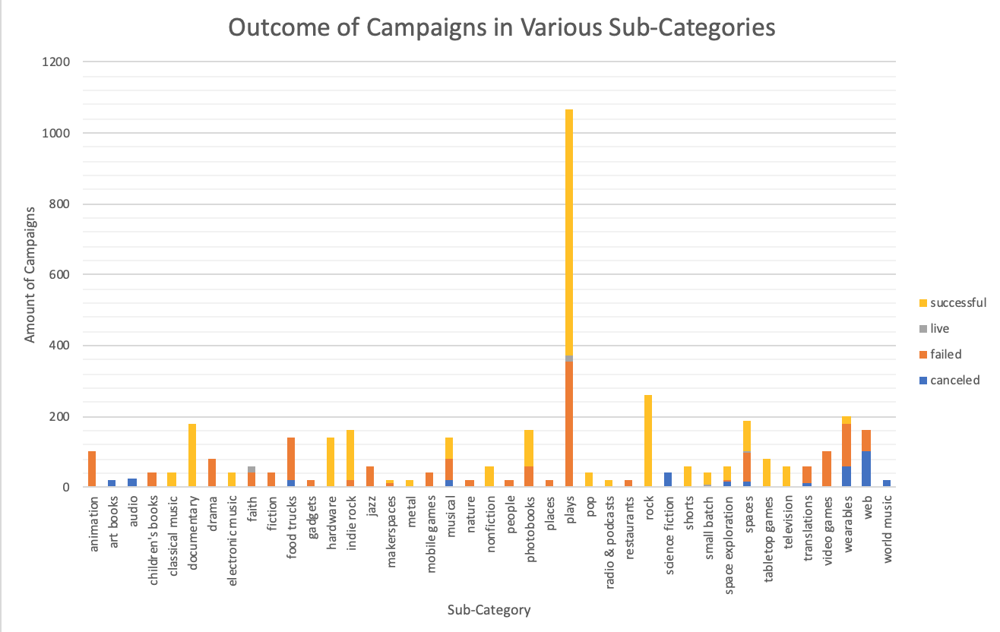
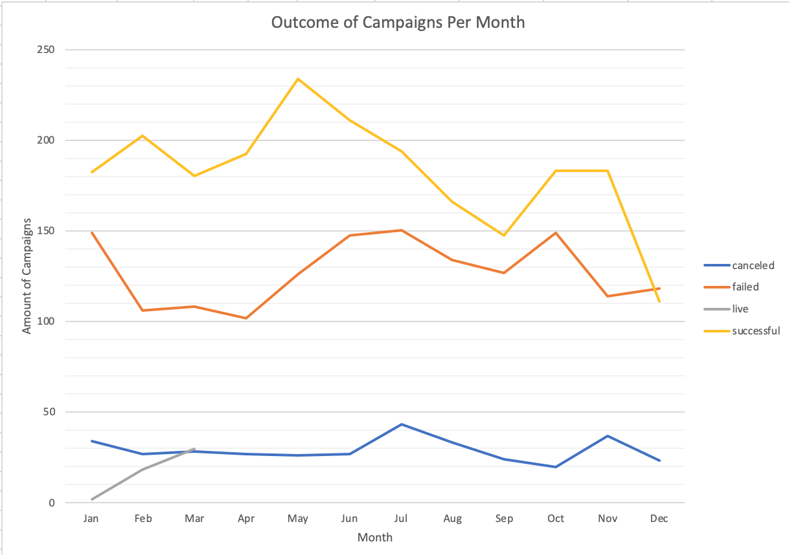
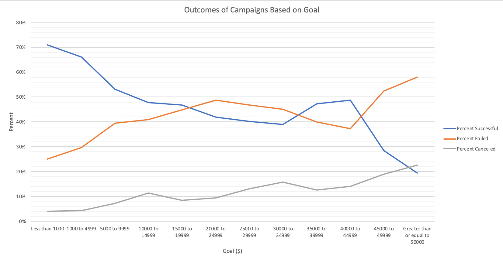

### Problem this analysis is trying to solve:

Over $2 billion has been raised using the crowdfunding service, Kickstarter, but not every project has found success. Of the more than 300,000 projects launched on Kickstarter, only a third have made it through the funding process with a positive outcome.

Getting funded on Kickstarter requires meeting or exceeding the project's initial goal, so many organizations spend months looking through past projects in an attempt to discover some trick for finding success. The purpose of this analysis is to organize and analyze a database of 4,000 past projects in order to uncover any hidden trends.

---

### How to View and Run the Code:

Open up file in Excel. Read through each worksheet to view data tables and graphs. The code had already been run.

---

### Data Collected:

---

### Why the data is displayed this way:

All of these charts were made using pivot tables. The first two charts are bar graphs because the x-axis values are qualitative data. The different colors of the bars represents the outcome of the campaign, so you can clearly see how many of each category/subcategory was successful or not. The "Outcome of Campaigns per Month" chart is a line graph because it's showing change over time, allowing you to see during what time of year campaigns are more likely to be a success or failure. The "Outcome of Campaign Based on Goal" chart is also a line graph because it allows you see how the success of campaigns changes depending on the goal that it set.

---

### Kickstart Success Conclusion/Analysis:

Given the provided data, there are three conclusions we can draw about Kickstarter campaigns. First, we can conclude that the best categories to go into if you are starting a kickstarter campaign are theater and music, because theater has the most **amount** of successful campaigns, and music has the highest **percentage** of successful campaigns. The second conclusion we can draw is that the best subcategory to go into if you are starting a campaign is plays because plays have the most amount of successful campaigns overall, and music has the most amount of successful campaigns out of the subcategories that have 100% success. Finally, we can conclude that the best time to start a kickstarter campaign is in May, since there are the most amount of successful campaigns then, and the worst time to start is in December, as more campaigns fail than succeed then.

One limitation of this dataset is the small sample size. Only about 4,000 out of more than 300,000 projects were used in this study, which is less than 1.33% of the population size. Another limitation is that about 74% of the kickstarters are from the U.S., while the remaining 26% are from a variety of other countries, which means the data was not gathered evenly across the population.

One possible table/graph that we could create would display how many campaigns were successful/failed/canceled/live in each country. Another possibility is creating a table/graph showing how much total money was pledged in each category and how many total bankers there were for each category. Lastly, we could create a table/graph displaying how many of each category of campaign came from each country.

In this case, the median summarizes the data more meaningfully for both the successful and failed campaigns. This is because both types of campaigns have a large amount of outliers- 244 for successful campaigns and 192 for failed campaigns. This can be visualized in the two box plots provided. This means that many data points are far away from the average of each data set. Because the mean is sensitive to outliers, it gets skewed by all of those outliers, making it not a meaningful central tendency to use. Because the median is not sensitive to outliers, it is more meaningful in these two cases. This concept can also be visualized in the two histograms provided. Both types of campaigns have the vast majority of amount of bankers in the first frequency group.

There is more variability with successful campaigns. This makes sense because the more bankers a campaign has, the more likely it is to raise enough money and be successful. This means it is more likely for the successful campaigns to have a larger amount of bankers than the failed campaigns. This causes the data set to have more variability than failed campaigns, who generally have less bankers.
